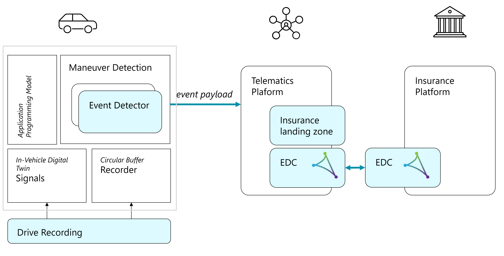

<!--
SPDX-FileCopyrightText: 2023 Contributors to the Eclipse Foundation

See the NOTICE file(s) distributed with this work for additional
information regarding copyright ownership.

Licensed under the Apache License, Version 2.0 (the "License");
you may not use this file except in compliance with the License.
You may obtain a copy of the License at

     http://www.apache.org/licenses/LICENSE-2.0

Unless required by applicable law or agreed to in writing, software
distributed under the License is distributed on an "AS IS" BASIS,
WITHOUT WARRANTIES OR CONDITIONS OF ANY KIND, either express or implied.
See the License for the specific language governing permissions and
limitations under the License.

SPDX-License-Identifier: Apache-2.0
-->

# Descristion
The [Eclipse SDV Blueprints](https://github.com/eclipse-sdv-blueprints) project is a collaborative initiative
led by Eclipse SDV members to bring the *software defined vehicle* concepts to life.

The project hosts a collection of blueprints that demonstrate the application of technologies developed in
the context of the [Eclipse SDV Working Group](https://sdv.eclipse.org).

This repository contains the **Insurance Blueprint**.

# Overview

The maneuver detection module consist of a collection of event detectors. Each detector monitors a number of signals (for example, speed, brake pedal position or steering wheel angle) at high resolution. When the monitor is triggered, it collects relevant signals associated to the event from the circular buffer. The event detector creates an event payload with additional metadata information. A cloud connector transports the event to the telematics platform.

The telematics platform (representing a vehicle OEM) stores all insurance events in an insurance landing zone. An Eclipse Dataspace component provides a catalog that describes both aggregated and individual datasets. A second Eclipse Dataspace component, representing the insurance company, uses the catalog to discover relevant signals and can connect to the event stream.

The code is organized in three parts:

- [Edge](./src/edge/README.md) contains examples for risk event detectors.
- *Telematics Platform* contains examples to receive vehicle data, store it and process it as a data product.
- *Insurance Platform* showcases consumption of data using *Eclipse Dataspaces*